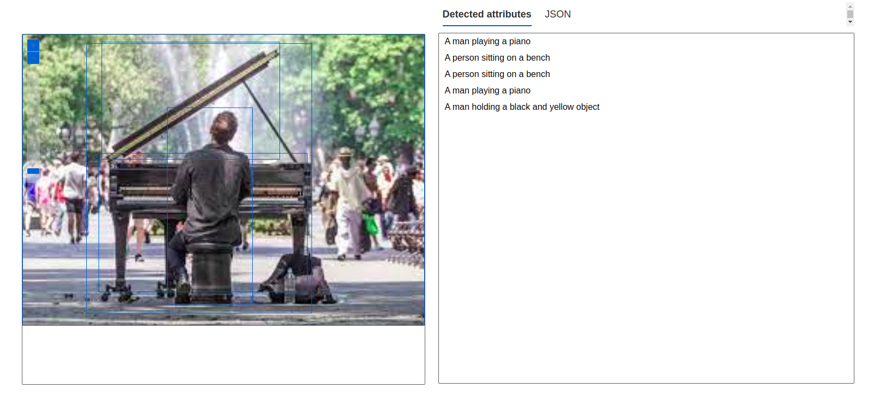
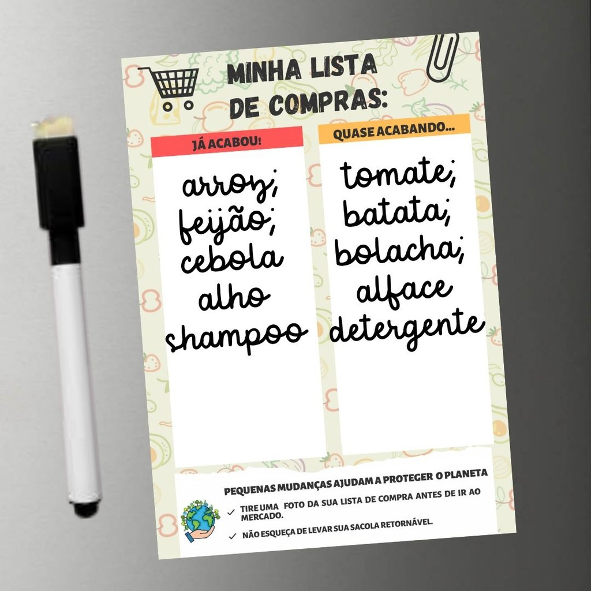
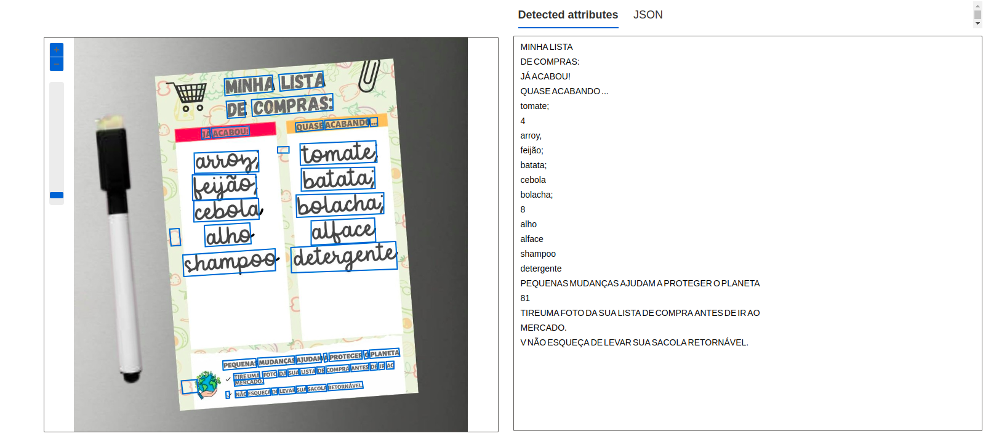

## Detect faces in the Vision Studio

Through the Microsoft Azure tool, it is feasible to detect human faces. Additionally, the platform has the capability to determine whether the presented face is wearing a facial mask or not.

For testing purposes, the following image was utilized:


With the outcome:


The tool further delivers the JSON file to us in this manner:

```
[
  {
    "recognitionModel": "recognition_01",
    "faceRectangle": {
      "width": 224,
      "height": 288,
      "left": 279,
      "top": -6
    },
    "faceLandmarks": {
      "pupilLeft": {
        "x": 343.6,
        "y": 96
      },
      "pupilRight": {
        "x": 438.6,
        "y": 125.7
      },
      "noseTip": {
        "x": 361.5,
        "y": 168.5
      },
      "mouthLeft": {
        "x": 313.1,
        "y": 183.7
      },
      "mouthRight": {
        "x": 413.6,
        "y": 216.3
      },
      "eyebrowLeftOuter": {
        "x": 322.2,
        "y": 64.6
      },
      "eyebrowLeftInner": {
        "x": 367.1,
        "y": 80.9
      },
      "eyeLeftOuter": {
        "x": 326.9,
        "y": 90.1
      },
      "eyeLeftTop": {
        "x": 347.3,
        "y": 90.8
      },
      "eyeLeftBottom": {
        "x": 339.5,
        "y": 99.7
      },
      "eyeLeftInner": {
        "x": 360.5,
        "y": 103.5
      },
      "eyebrowRightInner": {
        "x": 417.6,
        "y": 98.3
      },
      "eyebrowRightOuter": {
        "x": 478.1,
        "y": 119.5
      },
      "eyeRightInner": {
        "x": 420.3,
        "y": 122.6
      },
      "eyeRightTop": {
        "x": 438.1,
        "y": 118.2
      },
      "eyeRightBottom": {
        "x": 438,
        "y": 131.2
      },
      "eyeRightOuter": {
        "x": 457.9,
        "y": 130.8
      },
      "noseRootLeft": {
        "x": 369.9,
        "y": 114.9
      },
      "noseRootRight": {
        "x": 396.3,
        "y": 123.3
      },
      "noseLeftAlarTop": {
        "x": 349.9,
        "y": 144.8
      },
      "noseRightAlarTop": {
        "x": 393.8,
        "y": 158.8
      },
      "noseLeftAlarOutTip": {
        "x": 337,
        "y": 157.6
      },
      "noseRightAlarOutTip": {
        "x": 398.7,
        "y": 178.9
      },
      "upperLipTop": {
        "x": 359.9,
        "y": 199.8
      },
      "upperLipBottom": {
        "x": 355.9,
        "y": 204.5
      },
      "underLipTop": {
        "x": 350.2,
        "y": 223
      },
      "underLipBottom": {
        "x": 346.8,
        "y": 234.1
      }
    },
    "faceAttributes": {
      "mask": {
        "type": "noMask",
        "noseAndMouthCovered": false
      }
    }
  }
]

```

## The platform also possesses the capability to analyze images, thereby providing their content.

For testing purposes, the following image was utilized:


With the outcome:


The tool further delivers the JSON file to us in this manner:

```
{
  "apim-request-id": "84ff7a5e-5ab1-4479-bb86-acfda4769003",
  "content-length": "680",
  "content-type": "application/json; charset=utf-8",
  "modelVersion": "2023-10-01",
  "denseCaptionsResult": {
    "values": [
      {
        "text": "a man playing a piano",
        "confidence": 0.9118517637252808,
        "boundingBox": {
          "x": 0,
          "y": 0,
          "w": 264,
          "h": 191
        }
      },
      {
        "text": "a person sitting on a bench",
        "confidence": 0.6883388757705688,
        "boundingBox": {
          "x": 95,
          "y": 48,
          "w": 56,
          "h": 129
        }
      },
      {
        "text": "a person sitting on a bench",
        "confidence": 0.8561913371086121,
        "boundingBox": {
          "x": 50,
          "y": 78,
          "w": 137,
          "h": 91
        }
      },
      {
        "text": "a man playing a piano",
        "confidence": 0.8957638144493103,
        "boundingBox": {
          "x": 42,
          "y": 6,
          "w": 148,
          "h": 177
        }
      },
      {
        "text": "a man holding a black and yellow object",
        "confidence": 0.6932052373886108,
        "boundingBox": {
          "x": 52,
          "y": 5,
          "w": 117,
          "h": 77
        }
      }
    ]
  },
  "metadata": {
    "width": 264,
    "height": 191
  }
}
```

## The platform additionally conducts analysis on written documents and provides their transcription.

For testing purposes, the following image was utilized:


With the outcome:


The tool further delivers the JSON file to us in this manner:

```
[
  {
    "lines": [
      {
        "text": "MINHA LISTA",
        "boundingPolygon": [
          {
            "x": 389,
            "y": 107
          },
          {
            "x": 654,
            "y": 86
          },
          {
            "x": 656,
            "y": 127
          },
          {
            "x": 392,
            "y": 150
          }
        ],
        "words": [
          {
            "text": "MINHA",
            "boundingPolygon": [
              {
                "x": 390,
                "y": 107
              },
              {
                "x": 515,
                "y": 98
              },
              {
                "x": 517,
                "y": 141
              },
              {
                "x": 392,
                "y": 151
              }
            ],
            "confidence": 0.993
          },
          {
            "text": "LISTA",
            "boundingPolygon": [
              {
                "x": 532,
                "y": 96
              },
              {
                "x": 646,
                "y": 87
              },
              {
                "x": 648,
                "y": 128
              },
              {
                "x": 535,
                "y": 139
              }
            ],
            "confidence": 0.994
          }
        ]
      },
      {
        "text": "DE COMPRAS:",
        "boundingPolygon": [
          {
            "x": 395,
            "y": 165
          },
          {
            "x": 672,
            "y": 145
          },
          {
            "x": 674,
            "y": 188
          },
          {
            "x": 397,
            "y": 209
          }
        ],
        "words": [
          {
            "text": "DE",
            "boundingPolygon": [
              {
                "x": 395,
                "y": 166
              },
              {
                "x": 443,
                "y": 163
              },
              {
                "x": 445,
                "y": 207
              },
              {
                "x": 398,
                "y": 210
              }
            ],
            "confidence": 0.993
          },
          {
            "text": "COMPRAS:",
            "boundingPolygon": [
              {
                "x": 461,
                "y": 162
              },
              {
                "x": 672,
                "y": 146
              },
              {
                "x": 673,
                "y": 189
              },
              {
                "x": 463,
                "y": 205
              }
            ],
            "confidence": 0.993
          }
        ]
      },
      {
        "text": "JÁ ACABOU!",
        "boundingPolygon": [
          {
            "x": 328,
            "y": 236
          },
          {
            "x": 454,
            "y": 229
          },
          {
            "x": 456,
            "y": 255
          },
          {
            "x": 330,
            "y": 263
          }
        ],
        "words": [
          {
            "text": "JÁ",
            "boundingPolygon": [
              {
                "x": 330,
                "y": 237
              },
              {
                "x": 352,
                "y": 235
              },
              {
                "x": 354,
                "y": 262
              },
              {
                "x": 332,
                "y": 264
              }
            ],
            "confidence": 0.993
          },
          {
            "text": "ACABOU!",
            "boundingPolygon": [
              {
                "x": 357,
                "y": 235
              },
              {
                "x": 454,
                "y": 230
              },
              {
                "x": 456,
                "y": 254
              },
              {
                "x": 359,
                "y": 261
              }
            ],
            "confidence": 0.958
          }
        ]
      },
      {
        "text": "QUASE ACABANDO ...",
        "boundingPolygon": [
          {
            "x": 575,
            "y": 220
          },
          {
            "x": 789,
            "y": 207
          },
          {
            "x": 790,
            "y": 230
          },
          {
            "x": 576,
            "y": 245
          }
        ],
        "words": [
          {
            "text": "QUASE",
            "boundingPolygon": [
              {
                "x": 575,
                "y": 222
              },
              {
                "x": 646,
                "y": 216
              },
              {
                "x": 647,
                "y": 239
              },
              {
                "x": 577,
                "y": 246
              }
            ],
            "confidence": 0.993
          },
          {
            "text": "ACABANDO",
            "boundingPolygon": [
              {
                "x": 651,
                "y": 215
              },
              {
                "x": 764,
                "y": 209
              },
              {
                "x": 765,
                "y": 231
              },
              {
                "x": 652,
                "y": 239
              }
            ],
            "confidence": 0.993
          },
          {
            "text": "...",
            "boundingPolygon": [
              {
                "x": 769,
                "y": 209
              },
              {
                "x": 788,
                "y": 208
              },
              {
                "x": 789,
                "y": 230
              },
              {
                "x": 770,
                "y": 231
              }
            ],
            "confidence": 0.957
          }
        ]
      },
      {
        "text": "tomate;",
        "boundingPolygon": [
          {
            "x": 585,
            "y": 275
          },
          {
            "x": 787,
            "y": 268
          },
          {
            "x": 790,
            "y": 323
          },
          {
            "x": 585,
            "y": 331
          }
        ],
        "words": [
          {
            "text": "tomate;",
            "boundingPolygon": [
              {
                "x": 587,
                "y": 276
              },
              {
                "x": 784,
                "y": 268
              },
              {
                "x": 787,
                "y": 324
              },
              {
                "x": 588,
                "y": 332
              }
            ],
            "confidence": 0.88
          }
        ]
      },
      {
        "text": "4",
        "boundingPolygon": [
          {
            "x": 558,
            "y": 283
          },
          {
            "x": 558,
            "y": 309
          },
          {
            "x": 530,
            "y": 310
          },
          {
            "x": 529,
            "y": 284
          }
        ],
        "words": [
          {
            "text": "4",
            "boundingPolygon": [
              {
                "x": 558,
                "y": 283
              },
              {
                "x": 558,
                "y": 300
              },
              {
                "x": 529,
                "y": 300
              },
              {
                "x": 529,
                "y": 284
              }
            ],
            "confidence": 0.842
          }
        ]
      },
      {
        "text": "arroy,",
        "boundingPolygon": [
          {
            "x": 311,
            "y": 299
          },
          {
            "x": 483,
            "y": 293
          },
          {
            "x": 485,
            "y": 350
          },
          {
            "x": 312,
            "y": 353
          }
        ],
        "words": [
          {
            "text": "arroy,",
            "boundingPolygon": [
              {
                "x": 312,
                "y": 300
              },
              {
                "x": 479,
                "y": 294
              },
              {
                "x": 480,
                "y": 349
              },
              {
                "x": 313,
                "y": 353
              }
            ],
            "confidence": 0.679
          }
        ]
      },
      {
        "text": "feijão;",
        "boundingPolygon": [
          {
            "x": 307,
            "y": 357
          },
          {
            "x": 476,
            "y": 355
          },
          {
            "x": 478,
            "y": 411
          },
          {
            "x": 308,
            "y": 423
          }
        ],
        "words": [
          {
            "text": "feijão;",
            "boundingPolygon": [
              {
                "x": 307,
                "y": 357
              },
              {
                "x": 472,
                "y": 355
              },
              {
                "x": 475,
                "y": 416
              },
              {
                "x": 308,
                "y": 423
              }
            ],
            "confidence": 0.933
          }
        ]
      },
      {
        "text": "batata;",
        "boundingPolygon": [
          {
            "x": 587,
            "y": 340
          },
          {
            "x": 784,
            "y": 336
          },
          {
            "x": 785,
            "y": 392
          },
          {
            "x": 587,
            "y": 398
          }
        ],
        "words": [
          {
            "text": "batata;",
            "boundingPolygon": [
              {
                "x": 590,
                "y": 340
              },
              {
                "x": 781,
                "y": 337
              },
              {
                "x": 782,
                "y": 392
              },
              {
                "x": 590,
                "y": 399
              }
            ],
            "confidence": 0.715
          }
        ]
      },
      {
        "text": "cebola",
        "boundingPolygon": [
          {
            "x": 309,
            "y": 423
          },
          {
            "x": 492,
            "y": 417
          },
          {
            "x": 495,
            "y": 470
          },
          {
            "x": 309,
            "y": 479
          }
        ],
        "words": [
          {
            "text": "cebola",
            "boundingPolygon": [
              {
                "x": 311,
                "y": 424
              },
              {
                "x": 479,
                "y": 418
              },
              {
                "x": 481,
                "y": 472
              },
              {
                "x": 311,
                "y": 479
              }
            ],
            "confidence": 0.964
          }
        ]
      },
      {
        "text": "bolacha;",
        "boundingPolygon": [
          {
            "x": 575,
            "y": 409
          },
          {
            "x": 806,
            "y": 402
          },
          {
            "x": 807,
            "y": 458
          },
          {
            "x": 576,
            "y": 466
          }
        ],
        "words": [
          {
            "text": "bolacha;",
            "boundingPolygon": [
              {
                "x": 577,
                "y": 409
              },
              {
                "x": 805,
                "y": 403
              },
              {
                "x": 805,
                "y": 458
              },
              {
                "x": 578,
                "y": 467
              }
            ],
            "confidence": 0.736
          }
        ]
      },
      {
        "text": "8",
        "boundingPolygon": [
          {
            "x": 242,
            "y": 500
          },
          {
            "x": 280,
            "y": 496
          },
          {
            "x": 286,
            "y": 540
          },
          {
            "x": 245,
            "y": 543
          }
        ],
        "words": [
          {
            "text": "8",
            "boundingPolygon": [
              {
                "x": 248,
                "y": 498
              },
              {
                "x": 273,
                "y": 496
              },
              {
                "x": 277,
                "y": 540
              },
              {
                "x": 252,
                "y": 542
              }
            ],
            "confidence": 0.503
          }
        ]
      },
      {
        "text": "alho",
        "boundingPolygon": [
          {
            "x": 338,
            "y": 490
          },
          {
            "x": 465,
            "y": 482
          },
          {
            "x": 468,
            "y": 536
          },
          {
            "x": 339,
            "y": 542
          }
        ],
        "words": [
          {
            "text": "alho",
            "boundingPolygon": [
              {
                "x": 338,
                "y": 488
              },
              {
                "x": 457,
                "y": 482
              },
              {
                "x": 460,
                "y": 536
              },
              {
                "x": 341,
                "y": 543
              }
            ],
            "confidence": 0.963
          }
        ]
      },
      {
        "text": "alface",
        "boundingPolygon": [
          {
            "x": 616,
            "y": 477
          },
          {
            "x": 787,
            "y": 469
          },
          {
            "x": 790,
            "y": 531
          },
          {
            "x": 616,
            "y": 539
          }
        ],
        "words": [
          {
            "text": "alface",
            "boundingPolygon": [
              {
                "x": 616,
                "y": 476
              },
              {
                "x": 781,
                "y": 469
              },
              {
                "x": 784,
                "y": 531
              },
              {
                "x": 616,
                "y": 539
              }
            ],
            "confidence": 0.952
          }
        ]
      },
      {
        "text": "shampoo",
        "boundingPolygon": [
          {
            "x": 282,
            "y": 564
          },
          {
            "x": 538,
            "y": 547
          },
          {
            "x": 541,
            "y": 605
          },
          {
            "x": 284,
            "y": 621
          }
        ],
        "words": [
          {
            "text": "shampoo",
            "boundingPolygon": [
              {
                "x": 282,
                "y": 565
              },
              {
                "x": 522,
                "y": 549
              },
              {
                "x": 523,
                "y": 606
              },
              {
                "x": 285,
                "y": 621
              }
            ],
            "confidence": 0.948
          }
        ]
      },
      {
        "text": "detergente",
        "boundingPolygon": [
          {
            "x": 551,
            "y": 543
          },
          {
            "x": 841,
            "y": 529
          },
          {
            "x": 844,
            "y": 602
          },
          {
            "x": 553,
            "y": 611
          }
        ],
        "words": [
          {
            "text": "detergente",
            "boundingPolygon": [
              {
                "x": 563,
                "y": 546
              },
              {
                "x": 836,
                "y": 530
              },
              {
                "x": 840,
                "y": 602
              },
              {
                "x": 565,
                "y": 611
              }
            ],
            "confidence": 0.957
          }
        ]
      },
      {
        "text": "PEQUENAS MUDANÇAS AJUDAM A PROTEGER O PLANETA",
        "boundingPolygon": [
          {
            "x": 385,
            "y": 839
          },
          {
            "x": 847,
            "y": 806
          },
          {
            "x": 849,
            "y": 828
          },
          {
            "x": 387,
            "y": 863
          }
        ],
        "words": [
          {
            "text": "PEQUENAS",
            "boundingPolygon": [
              {
                "x": 386,
                "y": 840
              },
              {
                "x": 472,
                "y": 834
              },
              {
                "x": 474,
                "y": 857
              },
              {
                "x": 387,
                "y": 864
              }
            ],
            "confidence": 0.994
          },
          {
            "text": "MUDANÇAS",
            "boundingPolygon": [
              {
                "x": 477,
                "y": 833
              },
              {
                "x": 572,
                "y": 827
              },
              {
                "x": 574,
                "y": 849
              },
              {
                "x": 478,
                "y": 856
              }
            ],
            "confidence": 0.993
          },
          {
            "text": "AJUDAM",
            "boundingPolygon": [
              {
                "x": 576,
                "y": 826
              },
              {
                "x": 641,
                "y": 822
              },
              {
                "x": 642,
                "y": 844
              },
              {
                "x": 578,
                "y": 849
              }
            ],
            "confidence": 0.993
          },
          {
            "text": "A",
            "boundingPolygon": [
              {
                "x": 648,
                "y": 821
              },
              {
                "x": 657,
                "y": 820
              },
              {
                "x": 659,
                "y": 842
              },
              {
                "x": 650,
                "y": 843
              }
            ],
            "confidence": 0.985
          },
          {
            "text": "PROTEGER",
            "boundingPolygon": [
              {
                "x": 662,
                "y": 820
              },
              {
                "x": 748,
                "y": 814
              },
              {
                "x": 749,
                "y": 835
              },
              {
                "x": 663,
                "y": 842
              }
            ],
            "confidence": 0.993
          },
          {
            "text": "O",
            "boundingPolygon": [
              {
                "x": 752,
                "y": 813
              },
              {
                "x": 763,
                "y": 813
              },
              {
                "x": 764,
                "y": 834
              },
              {
                "x": 754,
                "y": 835
              }
            ],
            "confidence": 0.976
          },
          {
            "text": "PLANETA",
            "boundingPolygon": [
              {
                "x": 767,
                "y": 812
              },
              {
                "x": 844,
                "y": 807
              },
              {
                "x": 846,
                "y": 828
              },
              {
                "x": 769,
                "y": 834
              }
            ],
            "confidence": 0.993
          }
        ]
      },
      {
        "text": "81",
        "boundingPolygon": [
          {
            "x": 275,
            "y": 892
          },
          {
            "x": 320,
            "y": 889
          },
          {
            "x": 325,
            "y": 921
          },
          {
            "x": 276,
            "y": 928
          }
        ],
        "words": [
          {
            "text": "81",
            "boundingPolygon": [
              {
                "x": 278,
                "y": 892
              },
              {
                "x": 319,
                "y": 889
              },
              {
                "x": 322,
                "y": 922
              },
              {
                "x": 282,
                "y": 926
              }
            ],
            "confidence": 0.627
          }
        ]
      },
      {
        "text": "TIREUMA FOTO DA SUA LISTA DE COMPRA ANTES DE IR AO",
        "boundingPolygon": [
          {
            "x": 390,
            "y": 874
          },
          {
            "x": 833,
            "y": 840
          },
          {
            "x": 834,
            "y": 859
          },
          {
            "x": 392,
            "y": 894
          }
        ],
        "words": [
          {
            "text": "TIREUMA",
            "boundingPolygon": [
              {
                "x": 414,
                "y": 874
              },
              {
                "x": 481,
                "y": 868
              },
              {
                "x": 483,
                "y": 886
              },
              {
                "x": 416,
                "y": 892
              }
            ],
            "confidence": 0.851
          },
          {
            "text": "FOTO",
            "boundingPolygon": [
              {
                "x": 489,
                "y": 868
              },
              {
                "x": 525,
                "y": 865
              },
              {
                "x": 527,
                "y": 883
              },
              {
                "x": 491,
                "y": 886
              }
            ],
            "confidence": 0.99
          },
          {
            "text": "DA",
            "boundingPolygon": [
              {
                "x": 530,
                "y": 864
              },
              {
                "x": 551,
                "y": 863
              },
              {
                "x": 553,
                "y": 881
              },
              {
                "x": 532,
                "y": 882
              }
            ],
            "confidence": 0.996
          },
          {
            "text": "SUA",
            "boundingPolygon": [
              {
                "x": 555,
                "y": 862
              },
              {
                "x": 583,
                "y": 860
              },
              {
                "x": 585,
                "y": 878
              },
              {
                "x": 557,
                "y": 880
              }
            ],
            "confidence": 0.996
          },
          {
            "text": "LISTA",
            "boundingPolygon": [
              {
                "x": 586,
                "y": 860
              },
              {
                "x": 626,
                "y": 857
              },
              {
                "x": 628,
                "y": 875
              },
              {
                "x": 588,
                "y": 878
              }
            ],
            "confidence": 0.99
          },
          {
            "text": "DE",
            "boundingPolygon": [
              {
                "x": 630,
                "y": 856
              },
              {
                "x": 650,
                "y": 855
              },
              {
                "x": 651,
                "y": 873
              },
              {
                "x": 632,
                "y": 874
              }
            ],
            "confidence": 0.996
          },
          {
            "text": "COMPRA",
            "boundingPolygon": [
              {
                "x": 654,
                "y": 854
              },
              {
                "x": 714,
                "y": 850
              },
              {
                "x": 716,
                "y": 868
              },
              {
                "x": 655,
                "y": 873
              }
            ],
            "confidence": 0.994
          },
          {
            "text": "ANTES",
            "boundingPolygon": [
              {
                "x": 718,
                "y": 849
              },
              {
                "x": 765,
                "y": 846
              },
              {
                "x": 766,
                "y": 865
              },
              {
                "x": 720,
                "y": 868
              }
            ],
            "confidence": 0.994
          },
          {
            "text": "DE",
            "boundingPolygon": [
              {
                "x": 769,
                "y": 845
              },
              {
                "x": 787,
                "y": 844
              },
              {
                "x": 788,
                "y": 863
              },
              {
                "x": 770,
                "y": 865
              }
            ],
            "confidence": 0.997
          },
          {
            "text": "IR",
            "boundingPolygon": [
              {
                "x": 791,
                "y": 844
              },
              {
                "x": 806,
                "y": 843
              },
              {
                "x": 807,
                "y": 862
              },
              {
                "x": 792,
                "y": 863
              }
            ],
            "confidence": 0.989
          },
          {
            "text": "AO",
            "boundingPolygon": [
              {
                "x": 811,
                "y": 842
              },
              {
                "x": 831,
                "y": 841
              },
              {
                "x": 831,
                "y": 861
              },
              {
                "x": 812,
                "y": 862
              }
            ],
            "confidence": 0.993
          }
        ]
      },
      {
        "text": "MERCADO.",
        "boundingPolygon": [
          {
            "x": 414,
            "y": 890
          },
          {
            "x": 492,
            "y": 884
          },
          {
            "x": 493,
            "y": 899
          },
          {
            "x": 414,
            "y": 905
          }
        ],
        "words": [
          {
            "text": "MERCADO.",
            "boundingPolygon": [
              {
                "x": 416,
                "y": 890
              },
              {
                "x": 491,
                "y": 885
              },
              {
                "x": 493,
                "y": 900
              },
              {
                "x": 417,
                "y": 906
              }
            ],
            "confidence": 0.994
          }
        ]
      },
      {
        "text": "V NÃO ESQUEÇA DE LEVAR SUA SACOLA RETORNÁVEL.",
        "boundingPolygon": [
          {
            "x": 392,
            "y": 919
          },
          {
            "x": 749,
            "y": 893
          },
          {
            "x": 751,
            "y": 911
          },
          {
            "x": 393,
            "y": 937
          }
        ],
        "words": [
          {
            "text": "V",
            "boundingPolygon": [
              {
                "x": 394,
                "y": 920
              },
              {
                "x": 403,
                "y": 919
              },
              {
                "x": 404,
                "y": 937
              },
              {
                "x": 395,
                "y": 938
              }
            ],
            "confidence": 0.393
          },
          {
            "text": "NÃO",
            "boundingPolygon": [
              {
                "x": 418,
                "y": 918
              },
              {
                "x": 447,
                "y": 916
              },
              {
                "x": 448,
                "y": 934
              },
              {
                "x": 419,
                "y": 936
              }
            ],
            "confidence": 0.993
          },
          {
            "text": "ESQUEÇA",
            "boundingPolygon": [
              {
                "x": 450,
                "y": 916
              },
              {
                "x": 509,
                "y": 911
              },
              {
                "x": 510,
                "y": 930
              },
              {
                "x": 451,
                "y": 934
              }
            ],
            "confidence": 0.99
          },
          {
            "text": "DE",
            "boundingPolygon": [
              {
                "x": 512,
                "y": 911
              },
              {
                "x": 528,
                "y": 910
              },
              {
                "x": 529,
                "y": 928
              },
              {
                "x": 514,
                "y": 929
              }
            ],
            "confidence": 0.998
          },
          {
            "text": "LEVAR",
            "boundingPolygon": [
              {
                "x": 531,
                "y": 910
              },
              {
                "x": 573,
                "y": 907
              },
              {
                "x": 575,
                "y": 925
              },
              {
                "x": 533,
                "y": 928
              }
            ],
            "confidence": 0.994
          },
          {
            "text": "SUA",
            "boundingPolygon": [
              {
                "x": 577,
                "y": 906
              },
              {
                "x": 602,
                "y": 904
              },
              {
                "x": 604,
                "y": 923
              },
              {
                "x": 578,
                "y": 924
              }
            ],
            "confidence": 0.995
          },
          {
            "text": "SACOLA",
            "boundingPolygon": [
              {
                "x": 605,
                "y": 904
              },
              {
                "x": 654,
                "y": 901
              },
              {
                "x": 656,
                "y": 919
              },
              {
                "x": 607,
                "y": 922
              }
            ],
            "confidence": 0.989
          },
          {
            "text": "RETORNÁVEL.",
            "boundingPolygon": [
              {
                "x": 658,
                "y": 900
              },
              {
                "x": 749,
                "y": 894
              },
              {
                "x": 751,
                "y": 911
              },
              {
                "x": 660,
                "y": 918
              }
            ],
            "confidence": 0.923
          }
        ]
      }
    ]
  }
]
```
